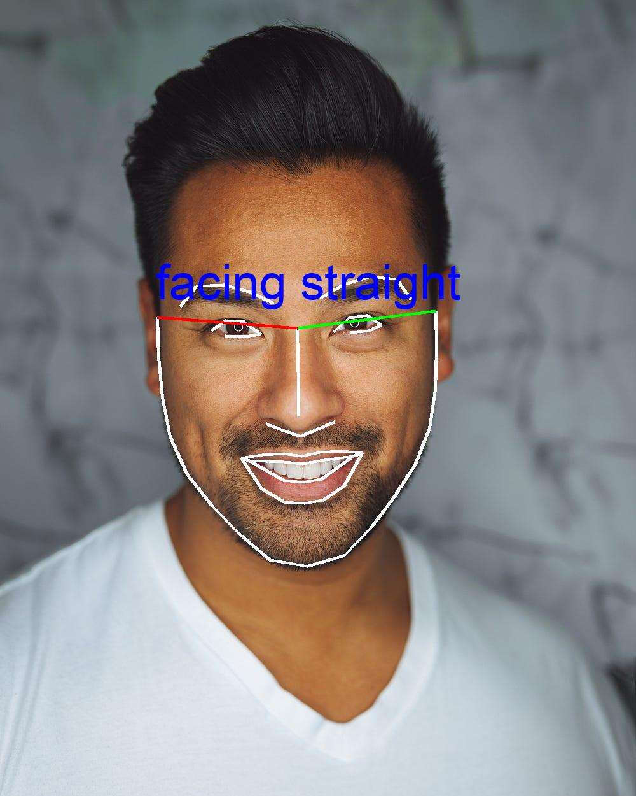

# How to Detect Head Turn with Face Landmarks


Photo by [🇸🇮 Janko Ferlič](https://unsplash.com/@itfeelslikefilm?utm_source=medium&utm_medium=referral) and [Prince Akachi](https://unsplash.com/@princearkman?utm_source=medium&utm_medium=referral) on [Unsplash](https://unsplash.com/)

**TLDR**: When turned left, the right chin is bigger than left one, vice versa. Use the distance between the right / left chin top and the nose top to measure the right / left chin size.

I have been using bank and payment app face authentication for years where you will be asked to open mouth, turn your head etc. to authenticate you don't hack with a static photo.
I figured out [how to detect mouth open](https://medium.com/towards-data-science/how-to-detect-mouth-open-for-face-login-84ca834dff3b) years ago, but how to detect head had puzzled me for years until recently the idea came to my mind all of a sudden and it is that simple, as shown above, once you know it. Depending on the face landmanks detection library you use, you can also use this method: When turned left, you show your right ear and hide the left one, vise versa.

To start with, we will be using two Python libraries, namely `dlib` and `face_recognition`, to help detect face landmarks and analyze them to infer head orientation.

## Setting Up the Environment

Before you can detect the head turn, you'll need to have the necessary libraries installed. You'll need [dlib](https://github.com/davisking/dlib), an open source toolkit in C++ for making real-world machine learning and data analysis applications including face detection and recognition, and [face_recognition](https://github.com/ageitgey/face_recognition), a dlib wrapper library that simplifies facial recognition processes and help you download the model file automatically and group face landmarks into facial features like eyes, nose, mouth and chin etc.

Install them using pip:

```sh
pip3 install dlib
pip3 install face_recognition
pip3 install Pillow
```

**Notes:**
1. dlib installation will take 10-15 minutes as it will build the C++ library on real-time. On Widnows, you need to install Visual Studio with C++ App Development selected first.

2. dlib python package provides Python interface as well, so you don't have to use face_recognition for production deployment. Refer to this [dlib only example](http://dlib.net/face_landmark_detection.py.html) for face landmarks detection.

3. We also install Pillow for image drawing, not required for production deployment.

## Understanding the Code


Photo on [Quotefancy](https://quotefancy.com/)

```python
#!/usr/bin/env python
from PIL import Image, ImageDraw, ImageFont
import face_recognition
import argparse
import math

argparser = argparse.ArgumentParser(description="Detect head turn")
argparser.add_argument(
    "image_file",
    help="Image file to detect head turn",
)
args = argparser.parse_args()

image_file = args.image_file

# Load the image file into a numpy array
image = face_recognition.load_image_file(image_file)

# Find face landmarks of all the faces in the image
face_landmarks_list = face_recognition.face_landmarks(image)
num_faces = len(face_landmarks_list)
print(f"Found {num_faces} face(s) in this photograph.")
# Get locations of all the faces in the image
face_locations = face_recognition.face_locations(image)

pil_image = Image.fromarray(image)
d = ImageDraw.Draw(pil_image)

facial_features = [
    "chin",
    "left_eyebrow",
    "right_eyebrow",
    "nose_bridge",
    "nose_tip",
    "left_eye",
    "right_eye",
    "top_lip",
    "bottom_lip",
]

# get landmarks of 1st face, assume there is only one face in the image
face_landmarks = face_landmarks_list[0]
# Let's trace out each facial feature with a line!
for facial_feature in facial_features:
    # print(f"{facial_feature} has {len(face_landmarks[facial_feature])} points: {face_landmarks[facial_feature]}")
    d.line(face_landmarks[facial_feature], width=5)

# draw left chin to nose top in green
d.line(face_landmarks["chin"][-1:] + face_landmarks["nose_bridge"][:1], width=5, fill=(0, 255, 0))
# draw right chin to nose top in red
d.line(face_landmarks["chin"][:1] + face_landmarks["nose_bridge"][:1], width=5, fill=(255, 0, 0))

def point_distance(p1, p2):
    """get distance of two points"""
    return math.sqrt( (p1[0] - p2[0])**2 + (p1[1] - p2[1])**2 )

# right / left chin ratio
left_chin_green = point_distance(face_landmarks["chin"][-1], face_landmarks["nose_bridge"][0])
right_chin_red = point_distance(face_landmarks["chin"][0], face_landmarks["nose_bridge"][0])
right_to_left_ratio = right_chin_red / left_chin_green
left_to_right_ratio = left_chin_green / right_chin_red

# Determine head turn!
threshold = 1.3  # customise your preference here
if left_to_right_ratio > threshold:
    turned = "turned right"
    print(f"green / red = {left_to_right_ratio:.1f}, {turned}")
elif right_to_left_ratio > threshold:
    turned = "turned left"
    print(f"red / green = {right_to_left_ratio:.1f}, {turned}")
else:
    turned = "facing straight"
    print(f"red / green = {right_to_left_ratio:.1f}, {turned}")

# Add text to the image for head turn orientation
top, right, bottom, left = face_locations[0]
position = (left, top) # write text from face location top left
font_size = (right - left) // 6 # relative to face size
font = ImageFont.truetype("arial.ttf", size=font_size)
text_color = (0, 0, 255)  # RGB color
d.text(position, turned, fill=text_color, font=font)

# Save drawn image
out_file = "out_" + image_file
print("saved to " + out_file)
pil_image.save(out_file)
```

The provided Python code describes a simple yet effective algorithm based on facial landmarks to detect head orientation. It implies drawing lines from the top of the chin on both sides to the top of the nose and comparing their lengths to determine which direction the head is turned.

**Notes:** `arial.ttf` is a Microsoft Windows font. If you run this script on Linux like Ubuntu, install the font as follows:
```
sudo apt install ttf-mscorefonts-installer
sudo fc-cache -f

# After that, check with:
fc-match Arial

# out:
Arial.ttf: "Arial" "Regular"
```

### Detailed Walkthrough

1. **Parse Command-Line Arguments**: Use `argparse` to provide the script with the path to the input image containing the face you want to analyze.

2. **Load and Process the Image**: Utilize the `face_recognition` library to load the image and detect the face location and landmarks grouped by facial features like chin, nose etc.

3. **Calculate Distances**: Implement a function to calculate the Euclidean distance between two points. Use this to find the distances from the points at the top of the right and left chin to the top of the nose.

    Given: Two points (x1, y1) and (x2, y2)

    Formula: `Distance = sqrt((x2 - x1)² + (y2 - y1)²)`

4. **Compare Distances**: If the distance on one side is significantly larger than on the other, conclude that the head is turned towards the shorter distance. For example, right chin distance is greater than left one, head is turned left.

5. **Displaying the Result**: Use `Pillow` (PIL fork) library to draw on the image, highlighting relevant landmarks. Add text to label the detected head orientation (turned right, turned left, facing straight). 

    Some tricks are used here to set label font size relative to the face size and write from face location top left.

6. **Save the Result**: Save the modified image to the disk for review.

## Running the Script

Run the script by passing the image file as an argument:

```sh
python detect_head_turn.py your_image_file.jpg
```

This command will generate an output image with the facial landmarks highlighted and the inferred head orientation labelled on the image.

### Sample 1: Turn Left
```sh
python detect_head_turn.py left.jpg

Out:
ound 1 face(s) in this photograph.
red / green = 2.9, turned left
saved to out_left.jpg
```

**Source Image:**


Photo by [🇸🇮 Janko Ferlič](https://unsplash.com/@itfeelslikefilm?utm_source=medium&utm_medium=referral) 

**Output Image:**


### Sample 2: Face Straight
```sh
python detect_head_turn.py straight.jpg

Out:
Found 1 face(s) in this photograph.
red / green = 1.0, facing straight
saved to out_straight.jpg
```

**Output Image:**



Source Photo by [Joseph Gonzalez](https://unsplash.com/@miracletwentyone?utm_source=medium&utm_medium=referral) on [Unsplash](https://unsplash.com?utm_source=medium&utm_medium=referral)


## Conclusion

Facial landmark detection serves as a powerful tool for understanding more about an individual's head orientation at a given moment. By analyzing the relative sizes of the chin regions, we can accurately predict the direction of a person's head turn. Utilizing a combination of `dlib` and `face_recognition` libraries simplifies the process, allowing us to build intelligent systems in a few lines of code.

## Citation
If you're using this article in your research or applications, please cite using this BibTeX:

```
@article{xie2023detectheadturn,
  title={How to Detect Head Turn with Face Landmarks},
  author={Xie, Peter Jiping},
  year={2023},
  contact={peter.jp.xie@gmail.com}
}
```
